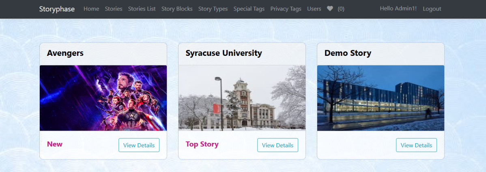
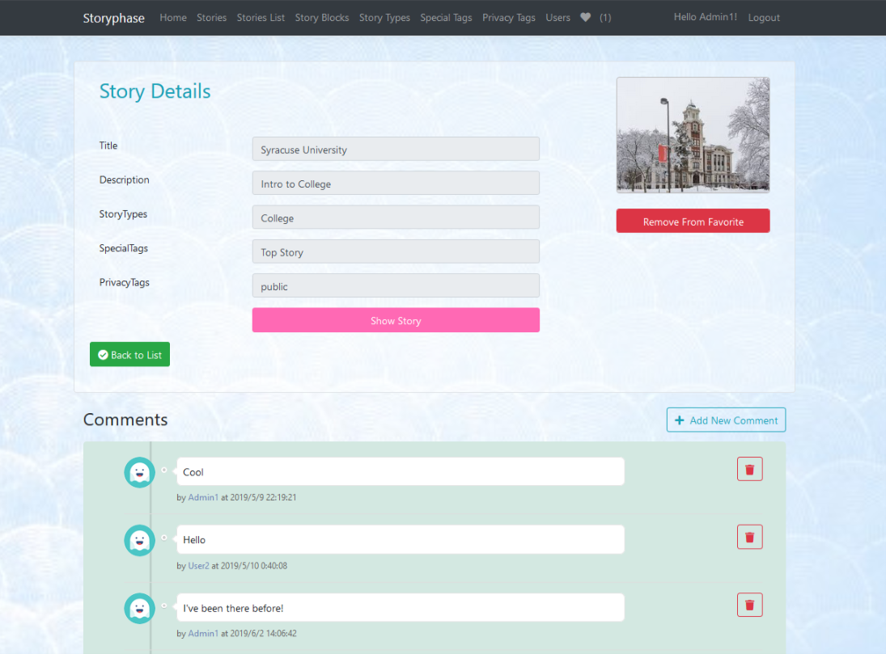
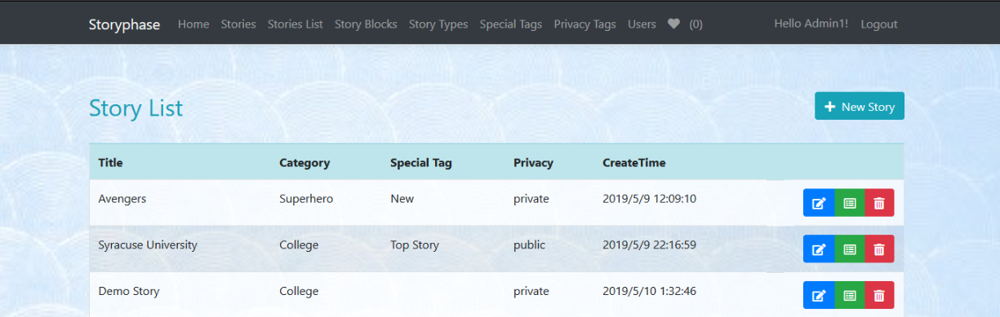
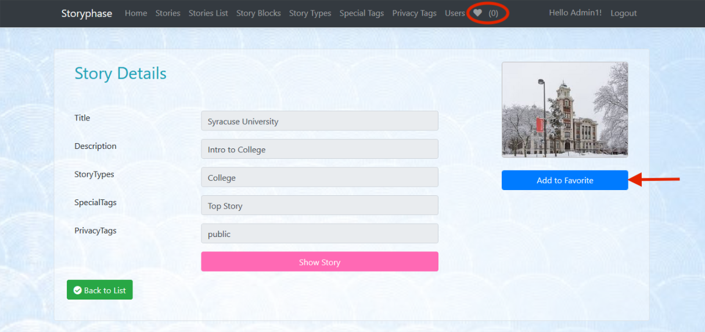
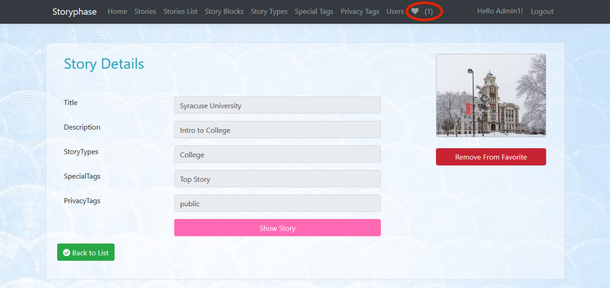
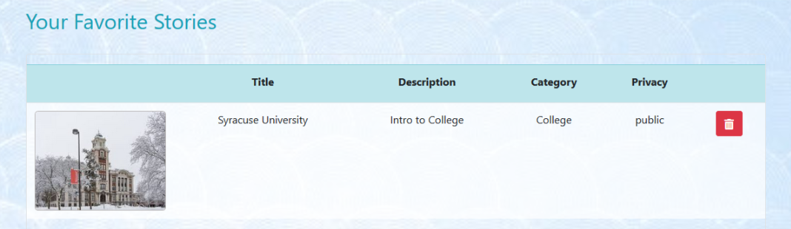

# Final Project - Storyphase

## 1. Introduction
Storyphase is a ASP.NET Core web application platform for users to create and share their stories freely with both authorization and authentication. <br><br>
This website supports both manual or automatic iteration for story display and simplifies the timeline management system so that users can change a story's timeline by simply drag and drop. For those public stories, other users will be allowed to comment on and add them to favorites while private stories will be kept only to the author. 

## 2. Structure
- Asp.net core MVC - main site
- Asp.net Web API - web service
- Web API Client (upload files)
- SQL db storage

## 3. Functionality

- Home Page 


- Authentication
<br>

- Selecting Stories


- Story Details and Comments


- Slideshow Display


- Change Timeline


- Suspend and Resume


- Story List


- Add to Favorites


  

  
  
## 4. Prerequisites
- .NET Core 2.2 SDK
- Visual Studio 2017
- Commend-line Tools
  - For Visual Studio, choose the Package Manager Console tools.
  - For other development environments, choose the .NET Core CLI tools.
- Entity Framework Core
  - Powershell
  ```
  Install-Package Microsoft.EntityFrameworkCore.SqlServer
  ```
  - Console
  ```
  dotnet add package Microsoft.EntityFrameworkCore.SqlServer
  ```

## 5. Run
- Clone or download this repository, navigate to `Internet Programming/Final Project/Storyphase` and open file `Storyphase.sln` with Visual Studio 2017. 

- Create a migration by running the following command:
  - Powershell:
    ```
    Add-Migration InitialCreate
    Update-Database
    ```
  - Console:
    ```
    dotnet ef migrations add InitialCreate
    dotnet ef database update
    ```
- Run the program on IIS Express server in Visual Studio.
