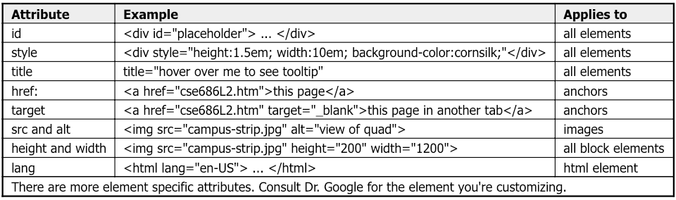

# Internet Programming


## ASP.NET

### MVC

- **Model**: Application data and bahavior in terms of its problem domain, independent of the UI
- **View:** 
  - The cshtml files with html and inline C# code, markup that inserted to the layout and displays to the user. 
  - Views are the results of controller actions(methods)
- **Controller**: Responsible for handling an HTTP request. (In ASP.NET, an action in controller will be selected to handle a particular request)
- **Router**: Select the right controller to handle the request.


## HTTP Handlers & Modules -> Middleware

#### Handlers

- Classes that implement [IHttpHandler](https://docs.microsoft.com/en-us/dotnet/api/system.web.ihttphandler)
- Used to handle requests with a given file name or extension
- [Configured](https://docs.microsoft.com/en-us/iis/configuration/system.webserver/handlers/) in *Web.config*

#### Modules

- Classes that implement [IHttpModule](https://docs.microsoft.com/en-us/dotnet/api/system.web.ihttpmodule)
- Invoked for every request
- Able to short-circuit (stop further processing of a request)
- Able to add to the HTTP response or create their own.
- [Configured](https://docs.microsoft.com/en-us/iis/configuration/system.webserver/modules/) in *Web.config*

#### Middleware -> Differences

- Middleware are simpler than HTTP modules and handlers
- Middleware are configured using code rather than in *Web.config*
- [Pipeline branching](https://docs.microsoft.com/en-us/aspnet/core/fundamentals/middleware/index?view=aspnetcore-2.2#use-run-and-map) lets you send requests to specific middleware, based on not only the URL but also on request headers, query strings, etc.

#### Middleware -> Similarity to modules

- Invoked in principle for every request
- Able to short-circuit a request, by [not passing the request to the next middleware](https://docs.microsoft.com/en-us/aspnet/core/migration/http-modules?view=aspnetcore-2.2#http-modules-shortcircuiting-middleware)
- Able to create their own HTTP response

#### Middleware -> Differences to Modules

- 


## Razor

- Razor can transition from HTML into C# or into Razor-specific markup. When an `@` symbol is followed by a [Razor reserved keyword](https://docs.microsoft.com/en-us/aspnet/core/mvc/views/razor?view=aspnetcore-2.2#razor-reserved-keywords), it transitions into Razor-specific markup, otherwise it transitions into C#.

- The scaffolding tool produces pages for Create, Read, Update, and Delete (CRUD) operations for the story model:

- ```
  dotnet aspnet-codegenerator razorpage -m Story -dc StoryphaseContext -udl -outDir Pages/Stories --referenceScriptLibraries
  ```

- Initial database schema:

- ```
  dotnet ef migrations add InitialCreate
  dotnet ef database update
  ```

- remove:

- ```
  dotnet ef migrations remove
  ```

- 

## Blah Blah

- **HTML** provides the *basic structure* of sites, which is enhanced and modified by other technologies like CSS and JavaScript.
- **CSS** is used to control *presentation, formatting, and layout*.
- **JavaScript** is used to control the *behavior* of different elements. (document tree won't use locking and not thread safe, JS is single threaded.)
-  <p>  inside list might not work as the spaces aren't in the right place sometimes, can use a <spacer-..

- 

## HTML

#### Basic Structure

- language for structuring content on a web page.
- Semantic structure (language for structuring content on a web page)
- Web of linked documents & Unlimited scope of information content
- Comment: <!-- comment -->
- An HTML element 
  - can only have one id and ids should be unique per page.
  - can have multiple classes, seperated by spaces. (order doesn't matter)
- Always use opening and closing tags together 
-  "div" will be taking its parents width. if only want to style part of the page, use a table cell instead.
-  don't use absolute position, it's fragile.

```html
<!DOCTYPE html>  <!-- this declaration tells the browser that this is HTML5 -->
  <html>
    <!-- 
      The head element may contain information for rendering
      but is not, itself, rendered (displayed in page).
    -->
    <head>
      metadata elements provide:
        - a title displayed in browser tab
        - information used by search engines
        - links to JavaScript files
        - links to CSS Style Sheets
      <script>
        local JavaScript code
      </script>
      <style>
        local CSS style definitions
      </style>
    </head>
    <!-- here is where rendering starts -->
    <body>
      content elements
    </body>
  </html>

```

#### HTML Elements

- **Block** elements, like <div>, have property display:block. They are boxes that stack vertically in their parent element's box. Each box has an outer margin box, in which is nested a border, then padding box, then content - like matryoshka dolls.
- **Inline** elements, like <span>, have property display:inline and flow left-to-right across their parent's content box, wrapping as needed to display their entire contents. They don't have the properties: height, width, margin-top, or margin-bottom.
- **Inline-block** elements have property display:inline-block and behave like inline elements, except that they honor height, width, and all margin properties.


#### HTML Flow

As we alter the size of a page, the contents flowing to match the current size of the window. 

There are three things that alter this flow model:

- Elements that have the property **position:absolute** are **removed** from the flow. Their positions are defined by properties: top, bottom, left, right, and z-index, they are <u>likely to be overwritten</u> (or underwritten) by content when the page size changes, and so are likely to lead to <u>fragile</u> designs.
- Elements that have **position:fixed** are fixed relative to the browser client area (viewport). Their positions are defined by properties: top, bottom, left, and right, z-index. Sites often use a menu fixed to the top of the viewport and a footer fixed to the bottom.
- Elements that have property **float: left**, or **float: right**, move to the left or right side of their container's box. Content flows around them, so are <u>less fragile</u> than absolute positioning.

#### HTML Attributes

-  **target attribute** specifies where the linked document will open when the link is clicked. 
  - The default is the current window. 
  - If **target**="_blank" , the linked doc will open in a new tab or (on older browsers) a new window.
- **anchor** object represents an HTML <a> element. This tag defines a hyperlink, which is used to link from one page to another.



#### HTML5 Features

- Semantic Markup:  header, footer, section, figure, article, nav...
- Local Storage:  provides cookie-like machenism, 4KB limit
- Canvas:  drawing region with commands, based on SVG, to draw diagrams.
- File API:  enables JavaScript to load and process files from a "sandboxed" local file system.
- Components:  reusable parts that provide custom capabilities for web pages.


## CSS

#### Basic

- Always use @import instead of <link rel="" href=""> to import css files. (firefox don't support)

- **Selector + Style**

  - Tag Selector: change the style of all elements with that tag (e.g. p, div, h1, ...)

    ``` p { color: green; } ```

  - Style individual / collections of elems --> add **id / class** attribute to the tags.

    ```#id { color: red; }```

    ```.class { color: blue; }```

- **Color: RGB** , #000000 is black and #FFFFFF is white --> e.g. to make magenta, R 255/FF + G 0/00 + B 255/FF

  - Decimal, each between 0-255 -->  ```body { background-color: rgb(255, 0, 255); } ```
  - Hexadecimal, each between 00-FF --> ```body { background-color: #ff00ff; }```
  - Shorthand Hexidecimal: also works --> ```body {backgtound-color: #f0f; }```
  - Color picker ✔️

- **Comment**: /* comment */

#### Advanced

- Cursor:  changes when user hovers over some link [demo](https://css-tricks.com/almanac/properties/c/cursor/)
- Styling Image: *color salmon (#fa8072)*

- ```css
  .kitten-image {
  border: 5px dashed salmon;
  border-radius: 5px;
  cursor: pointer;
  box-shadow: 5px 5px 20px #ccc;
  }
  ```

- Styling Text:

- ```css
  .udacity-text {
    font-family: Helvetica, Arial, sans-serif;
    font-size: 60px;
    font-weight: 900;
    text-transform: uppercase;
    text-decoration: underline;
    color: #8001ff;
  }
  ```

#### CSS References: 

- Mozilla Developer Network - [CSS Reference](https://developer.mozilla.org/en-US/docs/Web/CSS/Reference)
- css-tricks.com - [CSS Almanac](https://css-tricks.com/almanac/)

project-solution


## React

- React is JS view Library for building user interface

- Put React on your resume

- JSX -- JavaScript XML

- Babel -- Code Translator. Compile JSX code into calls to React that create element.

- **Hot Module Reloading**: Whenever we save the changes, this app is automatically restarted. no need to refresh the browser.

- "<div id="root"></div>" is the container of all components of the whole app.

### Component

- each component is a piece of UI, can be built in isolation and then put together, can also be reused.
- state: data we want ot display
  - When state changes, the React will essentially react to the change and update the DOM
- render: describe what the UI should look like

Storyphase

storyphase

## C#

- Server-side program that control how pages are generated